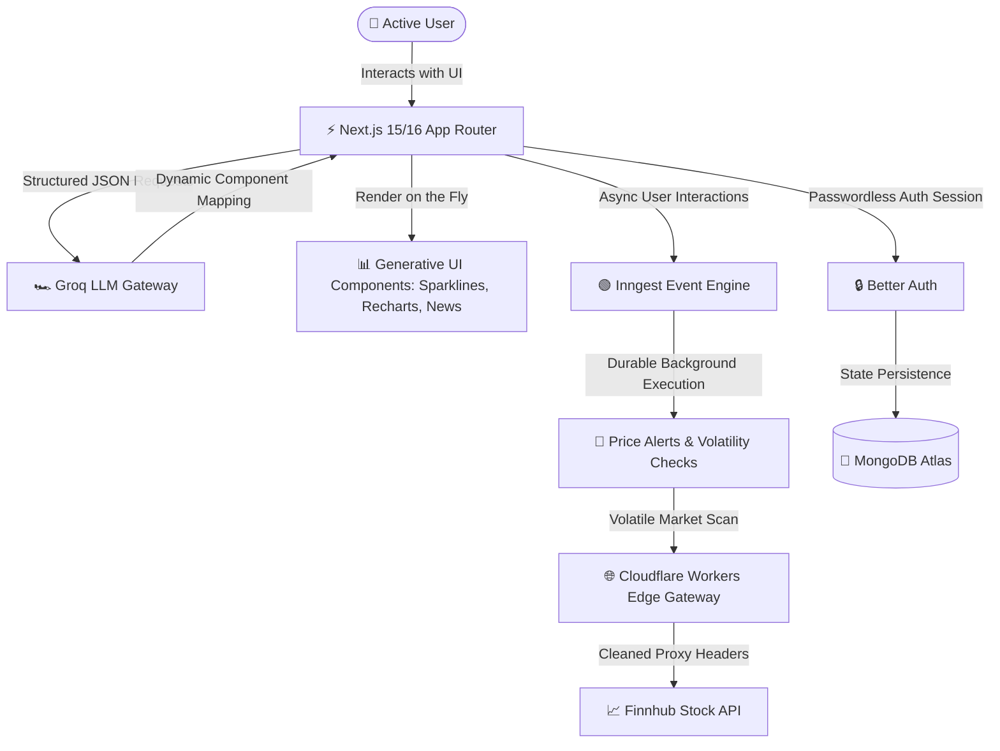

# <p align="center"><font face="cursive" color="#F59E0B">Koyn AI</font> 🪙</p>

### <p align="center">**An Event-Driven, Real-Time Stock Analytics Platform & Generative AI Financial Analyst**</p>

<p align="center">
  
  
  
  
  
  
</p>

---

## 🚀 The Wow Factor: Architecture at a Glance

**Koyn AI** is not just another basic dashboard. It is a high-performance, full-stack financial suite built with a modern edge-first and serverless architecture. By shifting heavy workloads to global edge proxies and orchestrating background tasks through a durable event-driven bus, Koyn delivers desktop-grade responsiveness and sub-second analytics.

### 🧩 System Flow & Topology



---

## 💡 Elite Technical Achievements

### 🎯 1. Generative UI Engine (Next-Gen AI UX)
* **The Mechanism:** Built a highly specialized natural language interface that streams structured JSON arrays directly from low-latency LLMs (Llama-3.3 via Groq / Google Gemini).
* **The Wow:** Instead of returning dry text, the front-end dynamically intercepts the JSON payloads and compiles interactive, fully functional components (e.g., custom sparklines with **Recharts**, Technical Volatility Gauges, Side-by-Side stock tables, and News Feeds) on-the-fly.

### 🛡️ 2. Resilient Edge Gateway (Zero-Cold-Start API Proxying)
* **The Mechanism:** Implemented a custom **Cloudflare Workers** edge proxy acting as a high-security API router.
* **The Wow:** By using request/response buffer cloning and dynamic header sanitization, it completely bypasses rigid host-header validation limitations of external financial APIs (Finnhub) while introducing robust CORS controls and caching logic directly at the cloud edge.

### ⏳ 3. Durable Event Orchestration (Fault-Tolerant Background Alerting)
* **The Mechanism:** Leveraged **Inngest** to replace fragile cron-jobs with a highly reliable event-driven flow engine.
* **The Wow:** Background stock monitoring, threshold alerts, and personalized daily email newsletters are queued and executed with automatic retries and state-concurrency protection. If a serverless function fails or hits an API rate limit, the transaction resumes seamlessly without losing the user's event state.

### 🔒 4. Secure Modern Data Persistence
* **The Mechanism:** Powered session security using **Better Auth** paired with a robust **MongoDB & Mongoose** data layer.
* **The Wow:** Features fully isolated user watchlist tables, resilient schema validation, and secure passwordless email sign-ins.

---

## 🛠️ Tech Stack & Key Libraries

| Component | Technology | Detail |
| :--- | :--- | :--- |
| **Frontend Framework** | **Next.js 16/15 (App Router)** | Server Components, Turbopack, Dynamic Router |
| **Edge Gateway** | **Cloudflare Workers** | Global Edge Router, CORS Sanitization, Stream Buffering |
| **Job Orchestration**| **Inngest** | Event-Driven durable state machine, background triggers |
| **AI Intelligence** | **Groq SDK & Gemini API** | Llama 3.3-70B, structured JSON generation |
| **Styling & UI** | **Tailwind CSS v4 + Radix UI** | Modern HSL-colors, glassmorphism, responsive sheet nav |
| **Data Viz** | **Recharts** | Interactive stock charts, custom linear gradients |
| **Database** | **MongoDB Atlas + Mongoose** | Flexible schema validation, session storage |
| **Authentication** | **Better Auth** | Cookie-based stateless sessions, clean login flows |

---

## ⚙️ Running Locally

1. **Clone and Install:**
   ```bash
   git clone https://github.com/Sandheep-S-95/Koyn-public_repo.git
   cd Koyn-public_repo
   npm install
   ```

2. **Environment Setup:**
   Create a `.env` in the root and include your keys:
   ```env
   MONGODB_URI=your_mongodb_connection_string
   GROQ_API_KEY=your_groq_api_key
   GEMINI_API_KEY=your_gemini_api_key
   INNGEST_EVENT_KEY=your_inngest_event_key
   INNGEST_SIGNING_KEY=your_inngest_signing_key
   BACKEND_API_URL=your_cloudflare_worker_proxy_url
   ```

3. **Launch Applications:**
   ```bash
   # Run local dev server
   npm run dev
   
   # Start local Inngest background dev server
   npx inngest-cli@latest dev
   ```

---
<p align="center">Made with ❤️ by <a href="https://github.com/Sandheep-S-95">Sandheep S</a></p>
